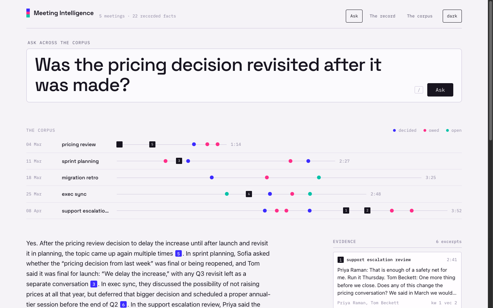
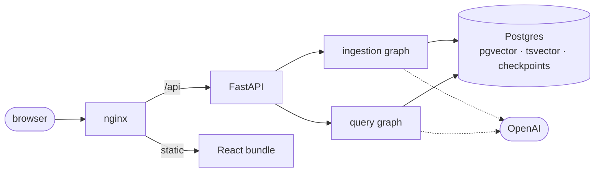

<div align="center">

# Meeting Intelligence

**Ask questions across your meeting transcripts, and get answers with the evidence behind them.**


**📖 [Full documentation](https://robsonfveiga.github.io/Meeting-Intelligence/)**

<picture>
  <source media="(prefers-color-scheme: dark)" srcset="docs/assets/images/ask-dark.png">
  
</picture>

</div>

---

Upload the WebVTT transcripts that Teams, Zoom and Whisper export. The system indexes
them for search and extracts each meeting's decisions, commitments and open threads.
Then ask questions one transcript can't answer: _was that decision revisited?_

Every claim is cited, every citation is checked in code, and if the corpus has no answer
the system says so instead of guessing.

## Quick start

Docker and Docker Compose are the only requirements.

```bash
cp .env.example .env      # defaults work; add your OPENAI_API_KEY
make up                   # Postgres, the API and the web interface
make seed                 # ingest the sample corpus
```

`make up` prints the two addresses. Without an API key everything still runs — keyword
search works, and each job records what was skipped.

|               |                                        |
| ------------- | -------------------------------------- |
| `make check`  | everything CI runs                     |
| `make eval`   | score retrieval against the golden set |
| `make studio` | open both graphs in LangGraph Studio   |
| `make docs`   | serve the documentation site           |

## Architecture

Two containers, one database.



- Postgres does three jobs: vector search, keyword search, and LangGraph checkpoints.
- The checkpoints double as the job store — if embedding fails, ingestion resumes from
  that step. No Celery, no Redis, no jobs table.
- The query pipeline loops: retrieve, grade the results, rewrite the query and retry once.

## RAG and model choices

- **LLM** — two tiers: `gpt-5.5` writes the answer, `gpt-5.4-mini` grades, rewrites and
  extracts. The small model runs constantly; a wrong grade only costs one extra retrieval.
- **Embeddings** — `text-embedding-3-small`. Cheap and good enough; the bottleneck was
  chunking, not the model.
- **Vector database** — Postgres with pgvector. I skipped Pinecone/Weaviate/Qdrant: at
  this scale they add ops overhead without a real gain, and vectors next to the data
  makes filtering one SQL query.
- **Orchestration** — LangGraph, chosen for ingestion first: checkpointed steps give
  resume and job status for free.
- **Retrieval** — hybrid. Meeting transcripts contain many proper names, numbers, dates, and identifiers. Vector embeddings may not preserve those exact details well, while keyword search can retrieve them very accurately. Results merge by rank (RRF).
- **Prompts** — excerpts go in as numbered, fenced blocks. The model cites `[3]`, so
  checking a citation is a range comparison.

## Guardrails

- Invalid citation markers are stripped after generation; the citation list is rebuilt
  from what's left.
- Extracted facts must point at turns the model was actually shown; the rest are dropped
  and counted. Names and timestamps come from the database, never from the model.
- Nothing retrieved → refuse, without calling the model.
- Transcripts are untrusted input: they only ever appear in user messages, and the answer
  step has no tools. Tested with injected transcripts.
- Every answer ships a trace: the query used, timings, tokens, and any dropped citations.

One known limit: the system verifies a citation _exists_, not that the excerpt supports
the claim.

## Key decisions

- **One input format.** One format done well beats four done adequately. I choose WebVTT since this is the format that Teams, Zoom and Whisper export and is a W3C standard.
- **Cues merge into turns first.** Subtitle files split one thought into fragments;
  merging them is what makes chunks worth retrieving.
- **Graph state carries IDs, never data.** Real output goes to Postgres.
- **No repository interfaces.** Plain functions taking a connection.
- **Facts don't feed retrieval.** The index holds verbatim transcript only, so a citation
  is always something a person said.
- **Skipped on purpose:** authentication, rate limiting, load testing, coverage gates,
  frontend unit tests.
- **Known gap:** extraction quality has no metric yet. The evidence is verified; whether
  the statement reads it fairly is not.

## Getting to production

- **A worker.** Ingestion runs in-process today. It is possible to run it in a Lambda worker
  calling the same graph.
- **CDN + load balancer.** CloudFront in front of the React bundle, an Application Load
  Balancer in front of the API. The API is stateless, so it scales horizontally behind it.
- **Managed services.** RDS with pgvector, S3 for uploads, Secrets Manager for keys.
- **Cloud Formation templates.** I would use Cloud Formation templates to deploy the infrastructure.

## With more time

- I Would add extra input formats if users need them.

---
