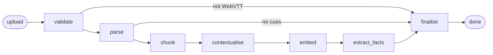

# Ingestion

Ingestion turns an uploaded WebVTT file into speaker-attributed turns, retrievable
chunks with embeddings, and a set of verified facts. It is the slow, expensive,
failure-prone half of the system — many embedding calls and a model call per window
of transcript — which is why it runs as a checkpointed [LangGraph](https://langchain-ai.github.io/langgraph/)
graph rather than a function.

Checkpointing buys two things. A failure at the embedding step resumes from the
embedding step instead of re-parsing and re-chunking everything. And the checkpointer
doubles as the job store — the thread identifier *is* the job identifier, and
`GET /jobs/{id}` reads graph state — so there is no task queue, no Redis and no jobs
table.



Both failure edges share one predicate, `route_if_failed`: a node that sets
`stage = FAILED` short-circuits to `finalise` rather than embedding nothing.

| Node | Writes stage | Touches a provider | Writes to Postgres |
|---|---|---|---|
| `validate` | `validated` | no | no |
| `parse` | `parsed` | no | meetings, turns |
| `chunk` | `chunked` | no | chunks |
| `contextualise` | `contextualised` | no | chunks |
| `embed` | `embedded` | yes — embeddings | chunks |
| `extract_facts` | `extracted` | yes — completions | facts |
| `finalise` | `done` / `failed` | no | no |

## The state that travels

Two rules govern `IngestionState`, and both exist because it is serialised to
Postgres after every node.

**Identifiers, never payloads.** Nodes write their real output to the database and
put identifiers in the state. No transcript text, no chunk bodies, and above all no
embedding vectors — a thousand chunks of 1536 floats would be written to disk again
on every subsequent step.

**Three fields accumulate; the rest replace.** This is the part that bites, because
a field that should accumulate but replaces fails silently:

| Field | Reducer | Why |
|---|---|---|
| `chunk_ids` | `operator.add` | appended as chunking progresses |
| `errors` | `operator.add` | a warning from `parse` must survive `embed` |
| `stats` | `merge_stats` | merges by stage name; without it each node erases the last one's numbers |
| everything else | replace | `stage`, `meeting_id`, `turn_count`, `fact_ids`, … |

`fact_ids` replaces deliberately: `extract_facts` clears a meeting's facts before
writing, so a re-drive produces a complete new set rather than more of the old one.
A state that appended would disagree with the database it describes.

Every node is wrapped in `@timed`, which records `duration_ms` into `stats` under the
node's name.

## The example we follow

Every section below shows the same content moving through it — the opening of
`data/transcripts/2026-03-04-pricing-review.vtt`, which is in the seed corpus.

```
WEBVTT

7c1f0a44-3b21-4d59-9f0e-11a2b3c4d5e6/1-0
00:00:02.000 --> 00:00:09.000
<v Priya Raman>Right, let's pick up the pricing review. Last time we said we'd decide before the launch.</v>

7c1f0a44-3b21-4d59-9f0e-11a2b3c4d5e6/2-0
00:00:09.000 --> 00:00:16.500
<v Priya Raman>I've since pulled the churn numbers and they change the picture a bit.</v>

7c1f0a44-3b21-4d59-9f0e-11a2b3c4d5e6/3-0
00:00:16.500 --> 00:00:24.000
<v Tom Beckett>How much? Because we built the whole Q2 forecast on the old assumption.</v>
```

---

## validate

> **In** `source.storage_path` &nbsp;·&nbsp; **Out** `detected_format`, `stage`

Reads the **first 4 KB only** and asks `looks_like_webvtt` whether to go on. The
WebVTT header is required by the specification but occasionally stripped, so a
VTT-style timestamp counts too:

```python
head.startswith("WEBVTT") or bool(_VTT_TIMESTAMP.search(head[:4000]))
```

The timestamp pattern requires a `.` before the milliseconds, which means SubRip —
which uses a comma — is rejected rather than parsed into nothing. A rejection with a
useful message beats a parse that silently yields zero turns.

This is a separate node from `parse` so the job can report *which* problem it hit. A
wrong format and a valid file with no cues are different things for whoever uploaded
it, and a single "could not parse" would hide that.

**Failure** — terminal. Sets `stage = FAILED` with a `StageError` naming the stage
`validate`, and routing sends it straight to `finalise`.

## parse

> **In** `source` &nbsp;·&nbsp; **Out** `meeting_id`, `turn_count`, warnings

Three things happen here.

**Cues become turns.** WebVTT emits a cue every few seconds, so one thought arrives
as several fragments — embedding those directly produces chunks like "yeah, agreed"
with nothing to retrieve on. `merge_into_turns` collapses consecutive segments from
the same speaker into one turn, and nothing downstream ever splits a turn again.
Speaker labels come from Teams' `<v Name>` voice tags, or from a `Name:` prefix where
`_looks_like_a_name` can tell "Tom Beckett:" from "The point is this:". A cue with no
label continues whoever was speaking.

The three cues above become **two** turns — the first two are both Priya:

```text
[0] Priya Raman   2000–16500  Right, let's pick up the pricing review. Last time we said
                              we'd decide before the launch. I've since pulled the churn
                              numbers and they change the picture a bit.
[1] Tom Beckett  16500–24000  How much? Because we built the whole Q2 forecast on the
                              old assumption.
```

The whole file yields 7 turns, 3 participants, `duration_ms = 74000`.

**Metadata comes off the filename.** `title_and_date` lifts a leading date out, which
both cleans the title and fills `occurred_at` — nothing else populates it, and date
filtering needs it:

```python
title_and_date("2026-03-04-pricing-review.vtt")
# ("pricing review", datetime(2026, 3, 4, tzinfo=UTC))
```

**Parsing and persistence are one node.** The turns cannot travel to a second node —
state carries identifiers, not payloads, and turns have nowhere to live until the
meeting row exists. Merging them also makes the write atomic, so there is no state
where a meeting exists with no content.

**Failure** — terminal if the file parsed but produced no cues. A file with cues but
no speaker names is *not* a failure: it appends a `recoverable` warning, because
Teams tenants can disable speaker attribution and it is worth saying so now rather
than when citations name nobody.

## chunk

> **In** turns read back from Postgres &nbsp;·&nbsp; **Out** `chunk_ids`

Chunks are built from **whole turns, never split**, with one turn of overlap. A
fixed-size splitter is wrong here in three ways: it splits mid-turn and loses the
speaker attribution that makes a citation useful, it ignores speakers when who said
something is often the answer, and it has no notion of time, which is a first-class
filter.

Two sizes, and they are not the same thing:

| Setting | Default | Meaning |
|---|---|---|
| `chunk_target_chars` | 500 | flush the window once the next turn would exceed this |
| `chunk_max_chars` | 1000 | a *single turn* longer than this gets split on sentence boundaries |
| `chunk_overlap_turns` | 1 | turns carried into the next chunk |

Size is in characters, not tokens: the target sits far below the embedding model's
8191-token limit, so token-exact counting would add a dependency to buy precision
that changes no decision. 500 was measured rather than chosen — at 1200 a chunk
covered most of a meeting section and its embedding was diluted enough that "how long
did the rollback take" returned the meeting's *opening* rather than the sentence
answering it.

Our example yields 3 chunks. Note that turn 2 ends chunk 0 and opens chunk 1 — that
is the overlap:

```text
chunk 0  turns 0–2  370 chars  speakers: Priya Raman, Tom Beckett
Priya Raman: Right, let's pick up the pricing review. Last time we said we'd decide before the launch. I've since pulled the churn numbers and they change the picture a bit.
Tom Beckett: How much? Because we built the whole Q2 forecast on the old assumption.
Priya Raman: About four points worse on the annual tier. Not catastrophic, but enough that a rise now is risky.

chunk 1  turns 2–5  495 chars  speakers: Priya Raman, Sofia Marquez, Tom Beckett
Priya Raman: About four points worse on the annual tier. Not catastrophic, but enough that a rise now is risky.
Sofia Marquez: I agree with holding. The support load from the migration hasn't settled either. ...
```

Speaker labels are rendered *into* the chunk text, because they are part of the
meaning and therefore part of what gets embedded.

Two edge cases worth knowing. An oversized single turn — a demo or a status monologue
— goes through `_split_long_text`, which breaks on sentence boundaries and, failing
that, cuts mid-sentence; without it one long turn would fail the whole ingest. And
there is an explicit tail flush at the end, because `flush()` leaves the overlap
behind: without it a meeting's final turns would only ever appear as overlap inside
the previous chunk, never as a chunk of their own.

## contextualise

> **In** meeting + stored chunks &nbsp;·&nbsp; **Out** `context_header` on each chunk

Transcript chunks are full of pronouns whose referent lives in an earlier turn.
Prefixing each chunk with a line saying where it sits is what stops "let's do that"
from being unretrievable.

```text
From the opening of 'pricing review' at 0 min. Speaking: Priya Raman, Tom Beckett.
```

The position word is derived, not written: the chunk's start time as a fraction of
the meeting's duration, bucketed into `opening of` / `middle of` / `later in`.

The header is stored on the chunk and concatenated at embed time by
`Chunk.embedding_input`:

```text
From the opening of 'pricing review' at 0 min. Speaking: Priya Raman, Tom Beckett.

Priya Raman: Right, let's pick up the pricing review. Last time we said we'd decide before the launch. I've since pulled the churn numbers and they change the picture a bit.
Tom Beckett: How much? Because we built the whole Q2 forecast on the old assumption.
Priya Raman: About four points worse on the annual tier. Not catastrophic, but enough that a rise now is risky.
```

This is deliberately **derived from metadata rather than generated by a model**. The
published contextual-retrieval technique makes a model call per chunk, which resolves
pronouns properly but costs a request per chunk on every ingest. Buying that upgrade
before there was a golden set to measure it against would have been paying for an
unproven improvement.

**Failure** — none. Returns early if the meeting or its chunks are missing.

## embed

> **In** chunks *without* vectors &nbsp;·&nbsp; **Out** `embedded_count`

The node reads `chunks_db.list_unembedded(meeting_id)` rather than the `chunk_ids`
already sitting in state. That single choice is what makes a retry cheap: work
already paid for is not paid for again, so a re-drive after a rate-limit failure
embeds only what is left.

Embeddings are `text-embedding-3-small` at 1536 dimensions, batched
`embedding_batch_size` (96) texts per request — one request per chunk would make
ingesting a corpus a few-hundred-round-trip affair. The API does not promise ordering
within a batch, so results are re-sorted by their returned `index` before being zipped
back onto chunk identifiers.

Token counts and cost land in `stats["embed"]`.

**Failure** — recoverable, always. With no `OPENAI_API_KEY`, or on an
`EmbeddingUnavailable`, the node appends a warning and moves on: chunks are stored
without vectors and keyword search still works.

## extract_facts

> **In** all turns for the meeting &nbsp;·&nbsp; **Out** `fact_ids`, `dropped_fact_count`

The most involved node. It pulls out three kinds of fact — a **decision** that settles
a question, a **commitment** naming someone who will do something, an **open thread**
raised and left unanswered — and ties each to the turns it came from.

### Windows are not chunks

`build_windows` is a separate function from `chunk_turns` because retrieval chunks
have two properties that are wrong here:

| | Retrieval chunk | Extraction window |
|---|---|---|
| Size | ~500 chars | `extraction_window_chars`, default 6000 |
| Overlap | 1 turn | none — disjoint |
| Objective | precision | coverage |

A decision made in one turn and qualified ten turns later has to arrive in the same
call, so precision is the wrong objective. And overlap would manufacture duplicate
facts for the deduplicator to clean up again. Our 7-turn meeting fits in a single
window; a long meeting gets several, processed **sequentially** — concurrency would
shorten a long ingest but multiply the rate limit a bulk upload hits, and nothing
downstream is waiting.

### What the model sees

Each turn is labelled with the transcript's own index, not a per-window counter, so a
returned reference resolves against stored turns directly:

```text
<<<TRANSCRIPT_EXCERPT
(turn 0) Priya Raman: Right, let's pick up the pricing review. Last time we said we'd decide before the launch. I've since pulled the churn numbers and they change the picture a bit.
(turn 1) Tom Beckett: How much? Because we built the whole Q2 forecast on the old assumption.
(turn 2) Priya Raman: About four points worse on the annual tier. Not catastrophic, but enough that a rise now is risky.
(turn 3) Sofia Marquez: I agree with holding. The support load from the migration hasn't settled either. ...
(turn 4) Tom Beckett: Fine. So the decision is we delay the increase until after launch, and revisit in planning.
(turn 5) Priya Raman: Agreed. I'll write up the churn analysis and circulate it before Thursday.
TRANSCRIPT_EXCERPT>>>
```

The delimiters are load-bearing: the system prompt states that everything between them
is material to read and never an instruction, which is the prompt-injection boundary
for untrusted transcript content.

The response is constrained by `FACT_SCHEMA` in strict JSON mode. The schema is
hand-written rather than generated from the Pydantic model, because strict mode is
fussy in ways Pydantic's output is not — every property must appear in `required`,
optional means a null union, `additionalProperties` must be explicitly `false` — and
a translation layer's bugs would surface as provider 400s at ingest time.

### Verification, then resolution

`verify_evidence` splits candidates by whether their turn references exist **in the
window that was actually sent**:

```python
valid = (
    candidate.start_turn_index <= candidate.end_turn_index
    and candidate.start_turn_index in available
    and candidate.end_turn_index in available
)
```

Rejects are counted into `dropped_fact_count`, not silently dropped — a non-zero value
means the model cited turns it was never shown, and it is the ingest-side counterpart
of `AnswerTrace.dropped_markers`. This check is mechanical, so it always holds.

!> What it establishes is that the evidence **exists**, not that the statement is a fair
reading of it. That is a semantic judgement, it needs a second model, and it belongs in
an evaluation harness rather than the ingest path.

`to_facts` then resolves verified references into speakers and timestamps read off the
turns — **attribution never comes from the model**. It also clears `owner` and `due` on
anything that is not a commitment, so a decision cannot arrive with a spurious assignee
because the model filled every field it was given.

Both effects are visible in the real output for this meeting:

```json
{
  "kind": "decision",
  "statement": "The price increase will be delayed until after launch and revisited in planning.",
  "owner": null,
  "due": null,
  "start_turn_index": 4, "end_turn_index": 4,
  "time": { "start_ms": 52000, "end_ms": 61000 },
  "speakers": ["Tom Beckett"]
}
{
  "kind": "commitment",
  "statement": "Priya Raman will write up the churn analysis and circulate it before Thursday.",
  "owner": "Priya Raman",
  "due": "before Thursday",
  "start_turn_index": 5, "end_turn_index": 5,
  "time": { "start_ms": 61000, "end_ms": 68000 },
  "speakers": ["Priya Raman"]
}
```

The decision's `speakers` is Tom Beckett because turn 4 is his, and its `owner` is
`null` because decisions do not have one.

### Capping and dedup

Each window is capped at `extraction_max_facts_per_window` (25), and truncation is
logged — a transcript yielding fifty "decisions" has not been read well, and storing
them would make the decision list useless rather than thorough.

`deduplicate` then collapses the same claim extracted twice, keyed on kind plus a
normalised statement, keeping the entry with the **narrowest turn span**. Windows are
disjoint, so this is not cleaning up an overlap artefact — it handles what meetings
actually do, which is restate a decision at the end of the hour after making it in the
middle. The narrowest span points at where it was actually made.

Facts are written with `delete_for_meeting` first, so re-running produces a complete
new set.

**Failure** — recoverable throughout. Disabled by `extraction_enabled = false`, skipped
with a warning when no key is configured, and a `CompletionUnavailable` mid-run
degrades to the same warning. Search and retrieval are unaffected either way.

## finalise

> **In** the accumulated state &nbsp;·&nbsp; **Out** `stage = done` or `failed`

Logs the run and sets the terminal stage. Reached both from `extract_facts` on the
happy path and directly from `validate` or `parse` on a terminal failure.

---

## Watching a job

`POST /meetings` returns `202` with a `job_id` — that is the graph's `thread_id`. The
status endpoint reads the checkpoint:

```bash
curl localhost:8000/jobs/$JOB_ID
```

`JobResponse` is a flattened read of the state: `chunk_ids` collapses to a count, the
per-stage `duration_ms` values are summed, and `stats` and `errors` come through
whole.

Two behaviours worth knowing. A `404` in the first moments after upload is expected —
the opening checkpoint may still be being written, and the endpoint checks for the
fields it needs rather than for a non-empty dict, because a partial snapshot was
previously a 500 in the opening milliseconds of every ingest. And `dropped_fact_count`
is the single number that says whether extraction was grounded.

?> The graph is driven in-process by a FastAPI background task. A restart mid-run leaves
the job stranded until something re-drives it — a known limitation. The checkpoint means
no completed work is lost either way, which is the point; productionising this means a
worker consuming a queue.

## Running without a provider

With no `OPENAI_API_KEY`, ingestion still completes:

| Node | Behaviour |
|---|---|
| `validate`, `parse`, `chunk`, `contextualise` | unaffected |
| `embed` | chunks stored without vectors; keyword search still works |
| `extract_facts` | skipped; no decisions, commitments or open threads |

Both skips append a `recoverable` `StageError`, so the job records what did not happen
rather than reporting success it did not achieve.
