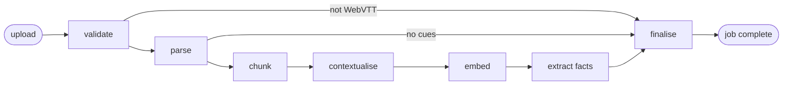
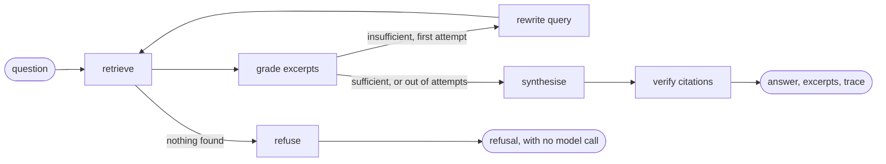

# Overview

Meeting Intelligence answers questions across a collection of meeting transcripts.
You upload WebVTT files — the format Microsoft Teams, Zoom and Whisper all export —
and it parses them into speaker-attributed turns, indexes them for hybrid retrieval,
and pulls out the decisions, commitments and open threads each meeting produced.

## The two graphs

Ingestion is the slow, expensive, failure-prone half: many embedding calls and a
model pass per window of transcript. It runs as a checkpointed graph, so a failure at
the embedding step resumes from the embedding step rather than re-parsing everything.



Querying retrieves, grades whether the excerpts can actually answer the question,
and rewrites the query once if they cannot.



## Running it

Docker and Docker Compose are the only requirements.

```bash
cp .env.example .env      # every value already has a working default
make up                   # Postgres, the API and the web interface
make seed                 # ingest the four-meeting sample corpus
```

`make up` prints the two addresses when it finishes.

## Where the code lives

```text
.
├── backend/
│   ├── app/
│   │   ├── api/            routes, and the request and response schemas
│   │   ├── clients/        the OpenAI client — embeddings, completions, streaming
│   │   ├── core/           pure logic: parsing, chunking, ranking, prompts, grounding
│   │   ├── db/             table definitions, and one query module per entity
│   │   ├── graphs/         ingest.py and query.py
│   │   ├── models/         every domain type, one per file
│   │   └── observability/  logging, tracing, per-stage timing
│   ├── alembic/            migrations; the schema is versioned, not inferred
│   ├── evals/              the golden set, and the retrieval harness that scores it
│   └── tests/              unit tests over core/, integration tests over the API
├── frontend/src/           React: api, components, hooks, models, styles
├── data/transcripts/       seed corpus, loaded by "make seed"
├── samples/                a spare transcript, deliberately outside the seed
└── docs/                   this site
```

Two conventions explain most of that shape.

**Logic lives in `core/`, infrastructure lives in the nodes.** Each graph node reads
state, calls a pure function, writes to Postgres and returns identifiers. The code most
likely to hide a subtle bug — ranking, chunking, citation verification — is therefore
testable in milliseconds with hand-written inputs and no provider.

**`models/` holds every domain type, one per file.** Nothing is defined inline where it
is used, so a type has one home and one import path however many layers touch it.
